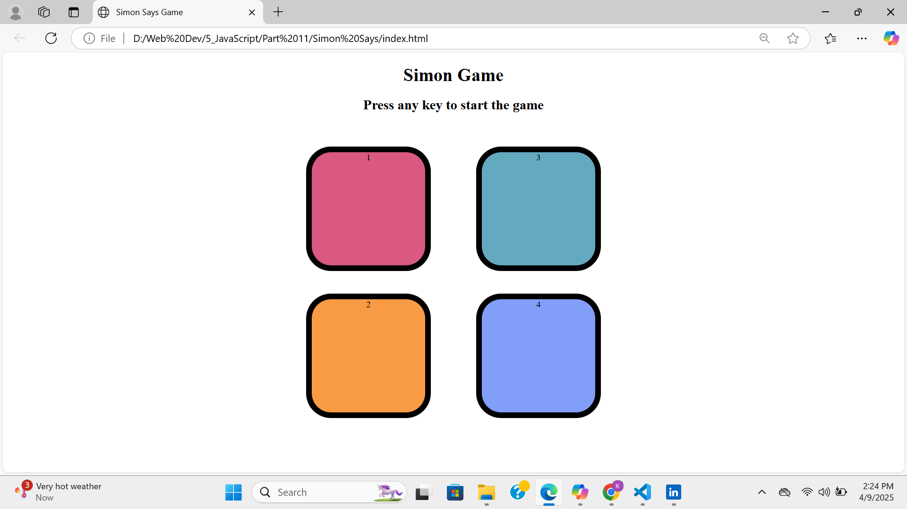

# Simon-Says-Game

This is a simple Simon Game built using **HTML**, **CSS**, and **JavaScript**. Challenge your memory skills by following dynamic sequences of colors in an engaging and interactive format.

## Features
- Interactive user interface with smooth animations.
- Memory challenge with increasing difficulty as the sequence grows.

## How to Play
1. Observe the sequence of colors displayed on the screen.
2. Repeat the sequence by clicking the corresponding buttons.
3. The sequence length increases after each successful attempt.
4. If you make a mistake, the game is over and you will have to restart the game!

## Screenshot

## Live Demo
Try the Simon Game live [here](https://github.com/kashish-0019/Simon-Says-Game).

## Repository
Find the source code on [GitHub](https://github.com/kashish-0019/Simon-Says-Game).

